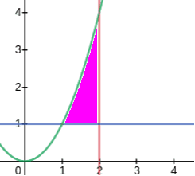

# Bài tập :: Tích phân 2 lớp
## # Tính tích phân
### + Bài 1
Hàm $x.\ln y$ với miền $D$

$$D=\begin{cases}
x=0\\
x=4\\
y=1\\
y=e
\end{cases}$$
Bài này miền $D$ có dạng hình chữ nhật (dạng đơn giản nhất luôn, ngon)

$$I=\int_{0}^{4}dx\int_{1}^{e}(x.\ln y)dy$$
$$=\int_{0}^{4}(x(y.\ln y-y)|\begin{matrix}e\\1\end{matrix})dx$$
$$=\int_{0}^{4}xdx$$
$$=\frac{x^2}{2}|\begin{matrix}4\\0\end{matrix}=8$$
### + Bài 2
Hàm $x^2+y^2$ với miền $D$
$$D=\begin{cases}
y=x^2\\
x=2\\
y=1\\
\end{cases}$$

Bài này áp dụng hình thang cong loại 1 hay loại 2 đều được (anh nghĩ vậy)

Anh sẽ áp dụng hình thang cong loại 1

$$I=\int_{1}^{2}dx\int_{1}^{x^2}(x^2+y^2)dy$$
$$=\int_{1}^{2}(x^2y+\frac{y^3}{3}|\begin{matrix}x^2\\1\end{matrix})dx$$
$$=\int_{1}^{2}(\frac{x^6}{3}+x^4-x^2-\frac{1}{3})dx$$
$$=\frac{x^7}{21}+\frac{x^5}{5}-\frac{x^3}{3}-\frac{x}{3}|\begin{matrix}2\\1\end{matrix}$$
$$=\frac{1006}{105}$$

Em yên tâm, đáp án anh dò lại rồi, đúng :D

___
:point_right: [TGet Homepage](/)