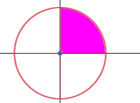

# Bài tập :: Tích phân 2 lớp
## # Tính tích phân
Tính tích phân bằng phương pháp đổi biến sang tọa độ cực

### + Bài 1
Hàm $\sqrt{x^2+y^2}$ với $D$ là phần tư thứ nhất của hình tròn $x^2+y^2\leq a^2$

$$\rightarrow S\begin{cases}0\leq r\leq a\\0\leq \varphi\leq \frac{\pi}{2}\end{cases}$$
$$I=\iint\limits_{S}\sqrt{r^2}rdrd\varphi$$
$$=\int_{0}^{\frac{\pi}{2}}d\varphi\int_{0}^{a}r^2dr$$
$$=\frac{\pi}{2}.(\frac{r^3}{3}|\begin{matrix}a\\0\end{matrix})=\frac{\pi}{2}.\frac{a^3}{3}=\frac{a^3\pi}{6}$$
___
:point_right: [TGet Homepage](/)