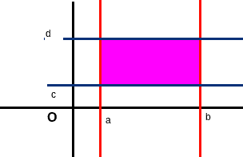
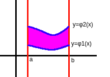
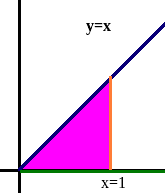
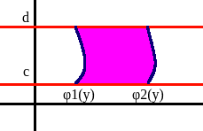

# Tích phân 2 lớp (Tích phân của hàm 2 biến)
## # Mục lục
:question: Lời nói đầu

:question: Định nghĩa

:question: Cách tính tích phân

## # Nội dung
### Lời nói đầu
Bản chất của phép tính tích phân là chia nhỏ ra và cộng lại. Tính phân của hàm 1 biến ta dùng để tính diện tích còn tích phân của hàm 2 biến ta dùng để tính thể tích còn tích phân của hàm 3 biến anh chưa học :D

### Định nghĩa
Cho $f(x,y)$ bị chặn trên miền hữu hạn $D$ của mặt phẳng $Oxy$.

Chia $D$ thành $n$ miền nhỏ là $\varphi_1,\varphi_2,...,\varphi_n$ và có diện tích lần lượt là $\Delta S_1,\Delta S_2,...\Delta S_n$

Trong mỗi miền nhỏ $\varphi_i$ lấy điểm tùy ý $(x_i,y_i)$ và lập tổng

$$\sum_{i=1}^{n}f(x_i,y_i).\Delta S_i$$

Khi đó

$\lim\limits_{n\to \infty} \displaystyle\sum_{i=1}^{n}f(x_i,y_i).\Delta S_i$ được gọi là tích phân 2 lớp của $f(x,y)$ trên miền $D$

Kí hiệu là

$$\iint\limits_Df(x,y)dS$$
hay 
$$\iint\limits_Df(x,y)dxdy$$

Ổn không nào?

Trong toán học thì thông thường sau khi nêu định nghĩa xong thì định nghĩa không còn dùng đến nữa.

### Cách tính tích phân
Tất cả các loại tích phân khi tính đến tận cùng thì chúng đều trở về dạng tích phân của hàm 1 biến (tích phân xác định) và kết quả của phép tính tích phân luôn là 1 con số.

Khi tính tích phân 2 lớp thì không chỉ cái hàm $f(x,y)$ gây khó dễ cho ta mà còn cái miền lấy tích phân $D$ nó cũng gây khó dễ :D. Bình thường thôi! Chơi nào!

#### + Khi miền D là hình chữ nhật (dễ lấy cận nhất)

$$D\begin{cases}
x = a\\
x = b\\
y = c\\
y = d
\end{cases}$$

Khi đó tính phân 2 lớp của $f(x,y)$ trên miền $D$ được tính theo công thức

$$\int_{a}^{b}dx\int_{c}^{d}f(x,y)dy$$
hay
$$\int_{c}^{d}dy\int_{a}^{b}f(x,y)dx$$

**Ví dụ nè:** Tính tích phân 2 lớp của hàm $x^2+xy$ trên miền $D$

$$D\begin{cases}
x = 0\\
x = 1\\
y = 0\\
y = 1
\end{cases}$$

Cực dễ!

$$I=\int_{0}^{1}dx\int_{0}^{1}(x^2+xy)dy$$
$$=\int_{0}^{1}(x^2y+x.\frac{y^2}{2}|\begin{matrix}1\\0\end{matrix})dx$$
$$=\int_{0}^{1}(x^2+\frac{x}{2})dx$$
$$=(\frac{x^3}{3}+\frac{x^2}{4})|\begin{matrix}1\\0\end{matrix}$$
$$=\frac{7}{12}$$

#### + Khi miền D là hình thang cong loại 1
$$D\begin{cases}
x = a\\
x = b\\
y = \varphi_1(x)\\
y = \varphi_2(x)
\end{cases}$$

Khi đó tính phân 2 lớp của $f(x,y)$ trên miền $D$ được tính theo công thức

$$\int_{a}^{b}dx\int_{\varphi_1(x)}^{\varphi_2(x)}f(x,y)dy$$
**Ví dụ nè:** Tính tích phân 2 lớp của hàm $z$ trên miền $D$
$$z=e^{\frac{y}{x}}dxdy$$
$$D\begin{cases}
y=x\\
y=0\\
x=1
\end{cases}$$

Dễ bình thường!
$$I=\int_{0}^{1}dx\int_{0}^{x}e^{\frac{y}{x}}dy$$
$$=\int_{0}^{1}(x.e^{\frac{y}{x}}|\begin{matrix}x\\0\end{matrix})dx$$
$$=\int_{0}^{1}(x.e-x)dx$$
$$=(\frac{ex^2}{2}-\frac{x^2}{2})|\begin{matrix}1\\0\end{matrix}$$
$$=\frac{e}{2}-\frac{1}{2}$$
#### + Khi miền D là hình thang cong loại 2
$$D\begin{cases}
x = \varphi_1(y)\\
x = \varphi_2(y)\\
y = c\\
y = d
\end{cases}$$

Khi đó tính phân 2 lớp của $f(x,y)$ trên miền $D$ được tính theo công thức

$$\int_{c}^{d}dy\int_{\varphi_1(y)}^{\varphi_2(y)}f(x,y)dx$$

___
:point_right: [Check out exercises](Calculus/A2/Exercises/function_2args_integral0)

:point_right: [TGet Homepage](/)
