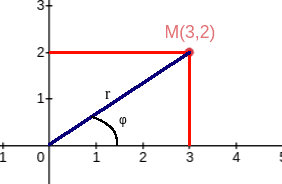

# Tích phân 2 lớp (Phần 2)
## # Mục lục
:question: Tọa độ của điểm trong hệ tọa độ cực

:question: Đổi biến trong hệ tọa độ cực

## # Nội dung
### Tọa độ của điểm trong hệ tọa độ cực
Cực dễ!

Như em đã biết thì tọa độ của điểm $M$ trong hệ tọa độ Descartes (hệ tọa độ $Oxy$) bao gồm hoành độ $x$ và tung độ $y$ nên mới viết là $M(x,y)$

Bây giờ, ta sẽ biểu diễn tọa độ điểm $M$ theo hệ tọa độ cực (lấy cực làm trung tâm) cực ở đây em hiểu là gốc tọa độ

Khi đó tọa độ của $M(x,y)$ sẽ được biểu diễn như sau

$$x=r.\cos \varphi$$
$$y=r.\sin \varphi$$

Trong đó

$r$: khoảng cách từ $O$ đến $M$

$\varphi$: góc tạo bởi $Ox$ và $OM$

**Chú ý quan trọng nè:** Trong hệ tọa độ cực ta luôn có $x^2+y^2=r^2$ (Pythagoras thôi)

### Đổi biến trong hệ tọa độ cực
#### + Tổng quát
$$\iint\limits_Df(x,y)dxdy$$

Vì $x,y$ được biểu diễn thành $r$ và $\varphi$ theo hệ tọa độ cực
$$x=r.\cos \varphi$$
$$y=r.\sin \varphi$$

nên tích phân trên sẽ trở thành
$$\iint\limits_Sf(r.\cos \varphi,r.\sin \varphi)r.dr.d\varphi$$
Trong đó, $S$ là miền lấy tích phân mới được xác định dựa vào $r$ và $\varphi$

Bình tĩnh! Có ví dụ là hiểu ngay à, nếu không hiểu nữa thì thôi vậy :D

#### + Dạng 1: D có dạng hình tròn tâm O
Tính tính phân của hàm $e^{-(x^2+y^2)}$ với miền $D$ là hình tròn $x^2+y^2\leq a^2$, $(a>0)$

Biểu diễn $x,y$ theo hệ tọa độ cực
$$x=r.\cos \varphi$$
$$y=r.\sin \varphi$$
$$\rightarrow S\begin{cases}0\leq r \leq a\\0\leq \varphi \leq 2\pi\end{cases}$$
Vì trong hệ tọa độ cực $x^2+y^2=r^2$ nên tích phân trở thành
$$\iint\limits_D e^{-(x^2+y^2)}dxdy$$
$$=\iint\limits_S e^{-r^2}r.dr.d\varphi$$
$$=\int_{0}^{2\pi} d\varphi\int_{0}^{a} e^{-r^2}r.dr$$
Vì tích phân phía sau không có $\varphi$ nên 2 tích phân này em có thể tính độc lập với nhau.
$$=2\pi\int_{0}^{a} e^{-r^2}.d(-r^2)(\frac{-1}{2})$$
$$=-\pi.(e^{-r^2}|\begin{matrix}a\\0\end{matrix})$$
$$=-\pi.(e^{-a^2}-1)$$

#### + Dạng 2: D có dạng hình tròn tâm nằm trên Ox
Mọi thứ vẫn vậy, chỉ có miền lấy tích phân $S$ là khác. Anh sẽ nói nhanh qua phần này rồi làm bài tập luôn :D

Miền $D: (x-a)^2+y^2\leq a^2$ . Miền $D$ lúc này là hình tròn tâm $T(a, 0)$ bán kính là a.

$$\rightarrow S\begin{cases}0\leq r\leq2a\cos \varphi\\-\frac{\pi}{2}\leq \varphi \leq \frac{\pi}{2}\end{cases}$$
 
#### + Dạng 3: D có dạng hình tròn tâm nằm trên Oy
Miền $D: x^2+(y-b)^2\leq b^2$ . Miền $D$ lúc này là hình tròn tâm $N(0, b)$ bán kính là b.

$$\rightarrow S\begin{cases}0\leq r\leq2b\sin \varphi\\0\leq \varphi \leq \pi\end{cases}$$

___
:point_right: [Check out exercises](Calculus/A2/Exercises/function_2args_integral1)

:point_right: [TGet Homepage](/#vi-tích-phân-a2-calculus-a2)
