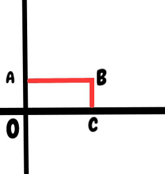

# Khảo sát hàm 2 biến (Phần 2)
## # Mục lục
:question: Cực trị có điều kiện

:question: Giá trị lớn nhất, nhỏ nhất

## # Nội dung
### Cực trị có điều kiện
Cực trị của hàm ) với điều kiện ràng buộc =0) được gọi là cực trị có điều kiện.

Anh chỉ biết có 2 phương pháp để tìm cực trị có điều kiện

#### + Phương pháp thế
Giả sử từ điều kiện ràng buộc =0) ta giải ra được ) (biễu diễn y theo x). Khi đó việc tìm cực trị có điều kiện của hàm ) được quy về việc tìm cực trị tự do (không điều kiện) của hàm ))

**Ví dụ:** Tìm cực trị của hàm  với điều kiện 

Từ điều kiện suy ra , thế vào z ta được

=f(x,1-x)=\sqrt{1-x^2-(1-x)^2}=\sqrt{2}.\sqrt{x-x^2}) (chỗ nào y em thay bằng 1-x)

Đây là hàm một biến của x xác định với  hay 

Lập bảng xét dấu thì anh thấy hàm số đạt cực tại tại .

#### + Phương pháp nhân tử Lagrange
**Điều kiện cần:** Cho  là cực trị của hàm . Khi đó  phải là nghiệm của hệ phương trình

Trong đó, 

được gọi là hàm Lagrange.

λ được gọi là nhân tử Lagrange

### Giá trị lớn nhất, nhỏ nhất
Các bước tìm giá trị lớn nhất, nhỏ nhất của hàm ) liên tục trên miền D đóng và bị chặn.

- **Bước 1:** Tìm các điểm dừng tại phần trong của hàm (tìm cực trị tự do)
- **Bước 2:** Tìm các điểm nghi ngờ ở biên (tìm cực trị có điều kiện)
- **Bước 3:** Thay các điểm tìm được vào ) để tính ra các giá trị từ đó xét xem giá trị nào là lớn nhất, nhỏ nhất.
___
**Ví dụ:** Tìm giá trị lớn nhất, nhỏ nhất của hàm sau

 trên hình chữ nhật 

- Bước 1: Tìm các điểm dừng tại phần trong của hàm

Ta được điểm  không thuộc phần trong nên ta không lấy điểm này.

- Bước 2: Tìm các điểm nghi ngờ ở biên

**Xét OA:**

 với 

Ta được điểm 

**Xét OC:**

 với 

=x-x^2)

=1-2x=0\rightarrow&space;x=\frac{1}{2})

Ta được điểm 

**Xét AB:**

 với 

=x-x^2&plus;1)

=1-2x=0\rightarrow&space;x=\frac{1}{2})

Ta được điểm 

**Xét CB:**

 với 

=-2&plus;y^2)

=2y=0\rightarrow&space;y=0)

Ta được điểm 

Tổng kết lại ta được các điểm nghi ngờ

\rightarrow&space;z(M_1)=0)

Em nhớ xét thêm các điểm ở đầu mút nữa nhé

\rightarrow&space;z(M_5)=1)

\rightarrow&space;z(M_6)=-1)

Xong rồi, bình tĩnh và xem lại nếu không hiểu, anh làm anh còn thấy căng mà :D

Vậy giá trị lớn nhất của z là 

và giá trị nhỏ nhất của z là -2

___
:point_right: [TGet Homepage](/#vi-tích-phân-a2-calculus-a2)
